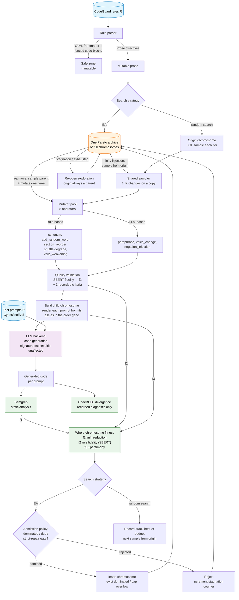

# Architecture

High-level design of the framework: the pipeline, the two search strategies, the
fitness model, and the data flow. For the module-by-module code reference, the
output schema, and extension points see [IMPLEMENTATION.md](IMPLEMENTATION.md);
for orientation see [README.md](README.md).

## System overview

The framework implements **Search-Based Software Testing (SBST)** over the space
of **rule-set configurations**. The unit of search is a **chromosome**: the entire
set of CodeGuard rules used by the experiment, where each *gene* is one rule's
text (original or a mutated allele) and a global *order gene* fixes the priority
with which rules are inserted into each prompt. Each iteration mutates one gene of
a chromosome, regenerates code for the prompts affected by that gene, scores the
result with Semgrep (security findings) and CodeBLEU (how much the generated code
changed), and assigns the objectives to the **whole chromosome**.



The mutator(s), validator, backend, and scorers are fixed; only the **search
strategy** differs between the two configurations
(see [The two search strategies](#the-two-search-strategies)).

## The pipeline, step by step

1. **Select** prompts from CyberSecEval (a language / count filter, seeded).
2. **Map** each prompt to the CodeGuard rules relevant to it (pre-computed retrieval maps under `rule_maps/`).
3. **Baseline**: evaluate the *origin chromosome* (all rules original, retrieval order) once — this seeds the per-case baseline Semgrep score and the reference code for divergence.
4. **Build a candidate**: either a random sample from the origin (random search, EA init/injection) or a local move on an archive parent (EA — mutate one gene, or with weight 0.1 a rule-order bump). A candidate that renders identically to its base is retried without spending budget.
5. **Validate** the mutation against four quality criteria — *informational*: the metadata is recorded and never gates the search.
6. **Render + generate**: render each prompt's rule block from the child chromosome's alleles in its order, then generate code. A **per-prompt signature cache** (keyed on rule versions + order) reuses results for prompts the change did not touch.
7. **Score** each prompt: Semgrep severity-weighted finding count, and code divergence `1 − CodeBLEU(generated, baseline-generated)`.
8. **Search**: aggregate the per-prompt scores into three whole-chromosome objectives and let the strategy decide what to keep.

## The three objectives (conservative set)

All maximised, assigned to the **whole chromosome**. This is the *conservative*
objective set. Two earlier divergence objectives (`proportion_divergent` /
`conditional_mean_divergence`) are still *recorded* per iteration as diagnostics
but do not steer the search.

| Objective | Definition | Captures |
|---|---|---|
| **f1** security fitness | Σ severity-weighted Semgrep delta vs baseline, **sign per `objective_direction`**: `minimize` (repair — the default) = `baseline − mutated` (higher f1 = *safer*); `maximize` = the secondary adversarial direction (`mutated − baseline`) | the primary signal: did the rule-set variant reduce vulnerable generation |
| **f2** rule fidelity | mean SBERT similarity of each *mutated* rule vs its original (1.0 = unchanged) — computed by the quality validator, so `--enable-validation` is mandatory on real runs | *faithfulness* — prefer repairs that barely change the rules' text |
| **f3** −parsimony | negated count of text-mutated rules | *minimality* — prefer repairs that touch fewer rules |

The **origin** chromosome scores (0, 1.0, 0) — zero delta, perfect fidelity, zero
edits — so under standard Pareto admission a candidate can only enter the archive
by improving on it (see the admission policy below). Rule **reordering** changes
no rule's text, so it leaves f2 = 1.0 and f3 = 0 and shows up only through f1;
the priority offsets are recorded as diagnostics.

## The two search strategies

Both run for the same **evaluation budget** (identity/no-op proposals are logged
and retried without consuming it, so the budget counts distinct scored
candidates; the real runs are wall-time-bounded and `max_iterations` is a soft
cap). Both **seed from the origin chromosome** through the *same* random sampler
(`build_random_chromosome`: stack `n ∈ [1, K]`, K=10, changes on a copy — per
change an order bump with prob `order_move_weight`=0.1, else one mutator on a
uniformly-picked rule's current allele, no mutator twice on the same rule, depth
≤ 4). They share mutators, validator, backend, scorers, and record schema, and
under a matched seed their opening draws coincide (common random numbers). They
differ only in what happens *after* a sample is scored. (Fairness is by equal
budget, not identical trajectories — Arcuri & Briand.)

### `ea` — (1+1) EA with random init + periodic injection

A single **Pareto archive** holds non-dominated *chromosomes* over (f1, f2, f3).
Three iteration phases, all charged to the one evaluation budget (each record
carries a `phase`):

- **init** (first `--ea-init-samples`, default 10) — independent random samples
  **from the origin**, offered to the archive. Population-style seeding: the 1+1
  loop then builds on the best of ten instead of one lucky/unlucky first move.
- **injection** (every `--ea-injection-every`-th iteration after init, default
  10) — one more origin-based random sample, offered by dominance. Diversity
  maintenance; the front is never wiped.
- **ea** (all other iterations) — sample a parent from the front ∪ {origin}
  (origin never evicted), take the **local move**: with prob 0.9 mutate ONE gene
  by applying one untried mutator on the parent's current allele (accepted
  mutations across rules stack; a saturated gene reverts to original instead),
  with prob 0.1 bump one rule's order priority (pre-filtered to bumps that
  actually change a prompt's render). Evaluate the whole chromosome and offer it.

**Admission** is a configurable ablation: `neutral_drift` (default — standard
Pareto; objective-equal order variants may be kept as neutral stepping-stone
parents) or `strict_repair` (require a strict f1 improvement over the origin).
In both, `best()` reports the origin unless a candidate strictly improves f1.
On cap overflow the archive evicts **lexicographically by f1** (lowest f1 first,
ties → f2+f3, then oldest; the just-added child is protected), so it never drops
its best repair to keep a near-baseline variant. On stagnation the archive
re-opens exploration (clears per-parent tried moves) rather than wiping the
front. Ablation knobs: `--ea-n-mutations >1` (chain per local move),
`--ea-move random_builder` (the move becomes the random sampler applied to the
archive parent — selection-only contrast), `--no-ea-origin-parent` (drop the
origin from the sampleable local-move parents — isolates the minimal
parsimony-1 anchor).

### `random_search` — i.i.d. best-of-budget sampling

The canonical baseline (Arcuri & Briand): every budgeted iteration is an
**independent** sample — a fresh copy of the origin through the shared sampler —
scored and recorded; nothing is carried forward, there is no archive and no
acceptance test. The reported result is the best sample of the budget, with the
origin as floor. Because each iteration restarts from the origin, this is true
i.i.d. random search, not a cumulative random walk.

## Data flow (per iteration)

```
rules map ──► select N cases (language filter, seed) ──► prompt + rule-IDs list
              baseline: evaluate origin chromosome once (per-case ref + score)
                                                                   │
                    ┌──────────── iteration i ────────────────────────────────────┐
                    │  build child C':                                             │
                    │    EA init/injection & random_search: C' = sampler(origin)   │
                    │    EA local move: C' = parent C with ONE gene mutated        │
                    │  (identity render vs base → log + retry, no budget spent)    │
                    │  validate each changed gene (informational; feeds f2)        │
                    │  render each prompt from C' (alleles in the order gene)      │
                    │  LLM: generate (signature cache skips unaffected prompts)    │
                    │  Semgrep batch (fresh only) + CodeBLEU per prompt            │
                    │  aggregate → whole-chromosome (f1, f2, f3)                   │
                    │  EA: offer C' to the archive │ random: record, start fresh   │
                    └────────────────────────────────────────────────────────────┘
```

Everything written to disk each iteration (the trajectory record, per-prompt
evaluations, the single chromosome-archive snapshot, mutated rule text per
evaluated iteration) is specified in
[IMPLEMENTATION.md → Output schema](IMPLEMENTATION.md#output-schema). Runs are
**schema_version 4**.
