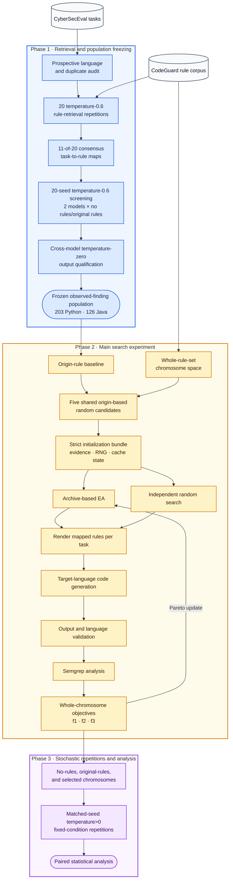

# Architecture

This document describes the study pipeline and the relationship between its
components. See [IMPLEMENTATION.md](IMPLEMENTATION.md) for the module and
artifact reference and [WORKFLOW.md](WORKFLOW.md) for commands.

## Study structure

The study has two main phases and one follow-up analysis stage:

1. **Phase 1 — retrieval and population freezing.** Retrieve the CodeGuard rules
   relevant to each task, aggregate repeated retrievals into consensus maps,
   screen the full language-compatible population under both no-rules and
   original-rules conditions, qualify the retained original-rule population at
   temperature zero, and freeze the shared Qwen/Llama task population and prompt
   contract.
2. **Phase 2 — search.** Evaluate the origin rule set, then compare an
   archive-based EA with independent random search over the same mapped rules,
   operators, five initial candidates, and scheduler allocation.
3. **Phase 3 — repetitions.** Re-evaluate no-rules, original-rules, and selected
   chromosomes at temperature>0 under multiple seeds for paired statistical
   analysis.

## Search representation

The unit of search is the entire mapped rule set. A
`RuleSetChromosome` stores only deviations from the origin:

- `genes`: mutated rule text and its ordered mutation path;
- `order_priority`: global priority offsets used when a task’s mapped rules are
  rendered;
- evaluated objectives and lineage identifiers.

`RuleSetSpace` owns the original text for every rule, renders the subset mapped
to each task, and computes content hashes. Rules that are never mapped to a task
are not part of the chromosome.

## Candidate evaluation

Every scored candidate follows the same path:

1. Render each task’s mapped rules from the chromosome.
2. Reuse a prior temperature-zero result when the task and rendered rule
   signature are identical; otherwise generate code.
3. Require one non-vacuous implementation in the language fixed by the map.
4. Normalize valid Java members or statements with a deterministic,
   scanner-only wrapper and retain the source-line map.
5. Run Semgrep. A failure affecting one generated task receives that task’s
   baseline score; a scanner or infrastructure failure aborts the evaluation.
6. Aggregate the three objectives and persist both candidate-level and
   task-level evidence.

The origin is evaluated first and remains the “do nothing” reporting reference.
It is not a Pareto-front member, an admission threshold, or an EA parent.

## Objectives

All three objectives are maximized over a whole chromosome.

| Objective | Definition | Role |
|---|---|---|
| f1 | Baseline raw Semgrep findings minus candidate findings | Primary repair objective |
| f2 | Mean SBERT similarity of mutated rules to their originals | Text fidelity |
| f3 | Negative number of text-mutated rules | Parsimony |

Severity-weighted findings, invalid-output counts, and order changes are
reported diagnostics; they are not additional optimization objectives.

## Shared initialization

EA and random search begin with the same five origin-based random candidates.
These evaluations are outside the main-loop budget, so total logical
evaluations are `E = 5 + B`.

For a matched model, language, seed, map, and prompt contract, the five
candidates are evaluated once and materialized as an initialization bundle.
The bundle contains:

- complete candidate chromosomes and aggregate fitness;
- per-task generated code, validation, and Semgrep evidence;
- search, mutator, and Torch CPU/CUDA RNG states at the boundary;
- the evaluation-cache state needed for identical downstream reuse;
- a strict identity over the code commit, model revision, population, rules,
  mutators, validator, and scanner provenance.

A mismatch rejects reuse. Loading a bundle therefore removes repeated work
without changing the subsequent random stream or cache behavior.

## Archive-based EA

The five initial candidates create the Pareto front without having to dominate
the origin. The main loop performs one of two actions:

- every tenth main-loop evaluation, inject an independent origin-based random
  chromosome;
- otherwise deep-copy a uniformly sampled front member and draw one move:
  mutate with probability 0.9 or reorder with probability 0.1.

A mutate move samples uniformly from all rules present in the frozen mapping.
If the selected rule can accept a lineage-unused mutator, exactly one mutator
is applied. If a mutated rule is saturated, it is reverted to its original
text. If the selected original rule cannot produce a valid move, the runner
tries another rule on the same parent, then another front parent, and finally an
origin-based random sample. Identity proposals do not consume an evaluation.

The archive is never cleared. Standard Pareto admission removes dominated
members. Its current capacity is six; on overflow, the lowest-f1 existing member
is removed, with f2+f3, invalid-output count, and age as tie-breakers.

## Independent random search

After the same five-candidate prefix, every main-loop candidate is an
independent origin-based sample. Nothing is carried forward and there is no
archive or acceptance test. The reported result is the best evaluated candidate
with the origin as the reporting floor.

## Comparison policy

The proposed primary EA-versus-random comparison is best f1 at the end of the
same scheduler allocation. Random search completes fewer, more expensive
evaluations; EA completes more local evaluations. That difference is part of
the algorithms’ behavior under equal compute time. 

Two secondary views make the trade-off visible:

- incumbent f1 against completed main-loop evaluations;
- incumbent f1 against elapsed main-loop time.

The five shared initialization evaluations are shown separately and are not
charged to `B`. A deliberately high main-loop evaluation ceiling acts only as a
safety bound; final time-budget runs normally stop on the scheduler’s
pre-timeout signal.

## Temperature>0 repetitions

The replicate runner loads the model once and evaluates one condition across
multiple seeds. Invalid generated outputs are missing observations with an
explicit denominator, never zero-finding scores. With-rules versus no-rules and
selected-chromosome effects are paired by seed and by the common set of valid
tasks.
