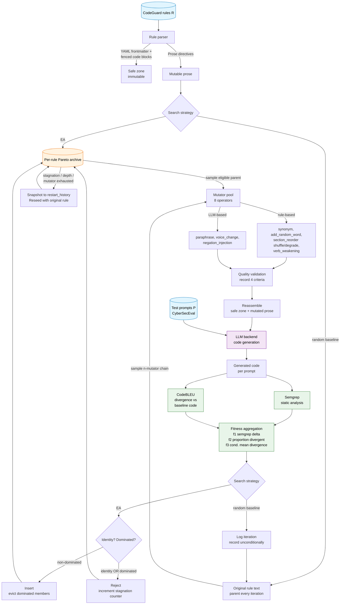

# Architecture

High-level design of the framework: the pipeline, the two search strategies, the
fitness model, and the data flow. For the module-by-module code reference, the
output schema, and extension points see [IMPLEMENTATION.md](IMPLEMENTATION.md);
for orientation see [README.md](README.md).

## System overview

The framework implements **Search-Based Software Testing (SBST)** over the space
of rephrasings of a CodeGuard security rule. Each iteration mutates a rule,
regenerates code for the prompts that use that rule, scores the result with
Semgrep (security findings) and CodeBLEU (how much the generated code changed),
and lets a search strategy decide what to keep.



The mutator(s), validator, backend, and scorers are fixed; only the **search
strategy** differs between the two configurations
(see [The two search strategies](#the-two-search-strategies)).

## The pipeline, step by step

1. **Select** prompts from CyberSecEval (a language / count filter, seeded).
2. **Map** each prompt to the CodeGuard rules relevant to it (pre-computed retrieval maps under `pipeline_breakdown/rule_retrieval_output/`).
3. **Mutate** the target rule with one of the 8 mutators, respecting the *safe-zone contract* (frontmatter, fenced code, and inline code are never touched).
4. **Validate** the mutation against four quality criteria — *informational*: the metadata is recorded for post-run analysis and never gates the search.
5. **Generate** code for every prompt that uses the rule, under the original rule (baseline, once) and under the mutated rule.
6. **Score** each prompt: Semgrep severity-weighted finding count, and code divergence `1 − CodeBLEU(generated, baseline-generated)`.
7. **Search**: aggregate the per-prompt scores into three objectives and let the strategy drive the next mutation.

## The three objectives

All maximised, aggregated over the prompts that actually use the target rule:

| Objective | Definition | Captures |
|---|---|---|
| **f1** `total_semgrep_delta` | Σ (mutated − baseline) severity-weighted Semgrep score | the primary signal: did the mutation make the model write *more vulnerable* code |
| **f2** `proportion_divergent` | fraction of affected prompts whose generated code changed (`code_divergence > 0`) | *breadth* — did the mutation change the output at all, on how many prompts |
| **f3** `conditional_mean_divergence` | mean code divergence over the prompts that did change | *intensity* — when the output changed, how much |

f2 and f3 matter because many prompts never produce a Semgrep finding even when
the mutation clearly changed the generated code; they record that the model
"did something different" due to the mutation, independent of whether Semgrep
flagged it.

## The two search strategies

Both run for the same iteration budget `T` (one code-generation call per
iteration → matched cost), share the same mutators, validator, backend, and
scorers, and emit the same per-iteration record. They differ only in selection
and acceptance.

### `ea` — (1+1) EA with a per-rule Pareto archive

Each rule keeps a small **Pareto archive** of non-dominated rule variants over
(f1, f2, f3). Each iteration: pick a rule, sample a parent from its archive,
apply one untried mutator, evaluate, and offer the offspring to the archive — it
is kept iff no existing member dominates it (dominated members are then
evicted). When a rule's archive stagnates, saturates its depth, or exhausts its
mutators, it restarts from the original rule (snapshotting the prior state).
This is a multi-objective hill-climb that simultaneously rewards more findings,
broader code change, and more intense code change.

### `random_baseline` — stateless multi-mutation sampler

The ablation that isolates the contribution of the archive + acceptance test. It
has **no archive, no acceptance test, no restart, and no cross-iteration state**:
each iteration independently picks a rule, samples `n ∈ {1..K}` distinct
mutators, applies that chain to the **original** rule text, evaluates, and logs
the result unconditionally. Same budget and same operators as the EA.

## Data flow (per iteration)

```
rules map ──► select N cases (language filter, seed) ──► prompt + rule-IDs list
                                                                   │
                       ┌─────────────── iteration i: target rule R ───────────────┐
                       │  strategy picks parent text + mutator(s) for R            │
                       │  validate (informational, post-hoc) → mutated R           │
                       │  assemble R into each prompt that uses it                 │
                       │  LLM: generate code (eval cache skips identical inputs)   │
                       │  Semgrep batch (one subprocess) + CodeBLEU per prompt     │
                       │  aggregate → (f1, f2, f3) over the affected prompts       │
                       │  EA: offer to archive   │   random: log unconditionally   │
                       └────────────────────────────────────────────────────────────┘
```

Everything written to disk each iteration (the trajectory record, per-prompt
evaluations, archive snapshots, mutated rule text) is specified in
[IMPLEMENTATION.md → Output schema](IMPLEMENTATION.md#output-schema).
