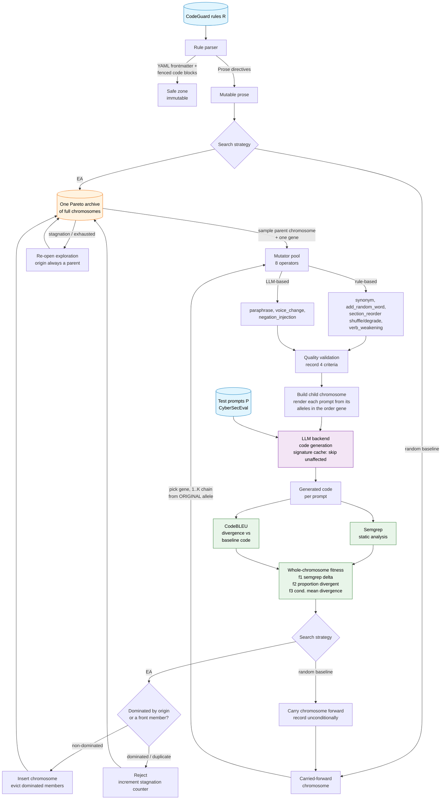

# Architecture

High-level design of the framework: the pipeline, the two search strategies, the
fitness model, and the data flow. For the module-by-module code reference, the
output schema, and extension points see [IMPLEMENTATION.md](IMPLEMENTATION.md);
for orientation see [README.md](README.md). The full rationale for the
chromosome design is in [CHROMOSOME_RESTRUCTURE_PLAN.md](CHROMOSOME_RESTRUCTURE_PLAN.md).

## System overview

The framework implements **Search-Based Software Testing (SBST)** over the space
of **rule-set configurations**. The unit of search is a **chromosome**: the entire
set of CodeGuard rules used by the experiment, where each *gene* is one rule's
text (original or a mutated allele) and a global *order gene* fixes the priority
with which rules are inserted into each prompt. Each iteration mutates one gene of
a chromosome, regenerates code for the prompts affected by that gene, scores the
result with Semgrep (security findings) and CodeBLEU (how much the generated code
changed), and assigns the objectives to the **whole chromosome**.



The mutator(s), validator, backend, and scorers are fixed; only the **search
strategy** differs between the two configurations
(see [The two search strategies](#the-two-search-strategies)).

## The pipeline, step by step

1. **Select** prompts from CyberSecEval (a language / count filter, seeded).
2. **Map** each prompt to the CodeGuard rules relevant to it (pre-computed retrieval maps under `rule_maps/`).
3. **Baseline**: evaluate the *origin chromosome* (all rules original, retrieval order) once — this seeds the per-case baseline Semgrep score and the reference code for divergence.
4. **Pick a move** on a parent chromosome: mutate one gene (one mutator, respecting the *safe-zone contract*), or — when enabled — reorder/revert a gene.
5. **Validate** the mutation against four quality criteria — *informational*: the metadata is recorded and never gates the search.
6. **Render + generate**: render each prompt's rule block from the child chromosome's alleles in its order, then generate code. A **per-prompt signature cache** (keyed on rule versions + order) reuses results for prompts the change did not touch.
7. **Score** each prompt: Semgrep severity-weighted finding count, and code divergence `1 − CodeBLEU(generated, baseline-generated)`.
8. **Search**: aggregate the per-prompt scores into three whole-chromosome objectives and let the strategy decide what to keep.

## The three objectives

All maximised, assigned to the **whole chromosome**. f2/f3 are scoped to the
*affected* prompts (those containing any mutated gene of the chromosome); f1 sums
over all prompts (unaffected prompts contribute a zero delta by construction).

| Objective | Definition | Captures |
|---|---|---|
| **f1** security fitness | Σ severity-weighted Semgrep delta vs baseline, **sign per `objective_direction`**: `maximize` = `mutated − baseline` (higher f1 = *more vulnerable*); `minimize` (repair runs) = `baseline − mutated` (higher f1 = *safer*) | the primary signal: did the chromosome move the model toward the objective |
| **f2** `proportion_divergent` | fraction of affected prompts whose generated code changed (`code_divergence > 0`) | *breadth* — how many affected prompts the chromosome changed |
| **f3** `conditional_mean_divergence` | mean code divergence over the affected prompts that did change | *intensity* — when the output changed, how much |

f2 and f3 matter because many prompts never produce a Semgrep finding even when
the mutation clearly changed the generated code; they record that the model
"did something different", independent of whether Semgrep flagged it.

## The two search strategies

Both run for the same iteration budget `T` (matched evaluation cost), **both seed
from the origin chromosome**, share the same mutators, validator, backend, and
scorers, and emit the same per-iteration record. They differ only in selection
and acceptance. (Fairness is by equal budget, not identical move operators —
Arcuri & Briand; the RQ3 comparison uses Mann-Whitney U + Vargha-Delaney Â₁₂.)

### `ea` — (1+1) EA with one full-chromosome Pareto archive

A single **Pareto archive** holds non-dominated *chromosomes* over (f1, f2, f3).
Each iteration: sample a parent chromosome (the origin is always available as a
parent), pick one gene, apply one untried mutator **on the parent's current
allele** (so accepted mutations across different rules stack — `R2'` and `R7'`
can coexist), evaluate the whole chromosome, and offer the child — it is kept iff
neither the origin nor any front member dominates it (dominated members are then
evicted; duplicates by content hash are rejected). On stagnation the archive
**re-opens exploration** (clears exhausted moves) rather than wiping the front;
the origin chromosome is never evicted. `--ea-n-mutations` (default 1 = Design A)
optionally applies a 1..n chain per move (Design B). Order/reverse moves are built
but gated (`--order-move-weight` / `--reverse-move-weight`, default 0).

### `random_baseline` — persistent single-chromosome random walk

The ablation that isolates the contribution of the archive + guided selection. It
keeps **one carried-forward chromosome, no archive, no acceptance test, no
restart**: each iteration picks a rule, samples `n ∈ {1..K}` distinct mutators,
applies that chain **to the ORIGINAL allele** of that rule, overwrites that gene
in the current chromosome, evaluates the whole rule set, and always carries the
result forward. Breadth accumulates across genes; any single gene is a fresh
1..K-chain from original. Same budget and operators as the EA.

## Data flow (per iteration)

```
rules map ──► select N cases (language filter, seed) ──► prompt + rule-IDs list
              baseline: evaluate origin chromosome once (per-case ref + score)
                                                                   │
                    ┌──────────── iteration i: parent chromosome C ───────────────┐
                    │  strategy picks a gene + mutator(s)                          │
                    │  validate (informational, post-hoc)                         │
                    │  child C' = C with one gene mutated (EA: stack; rand: orig) │
                    │  render each prompt from C' (alleles in the order gene)      │
                    │  LLM: generate (signature cache skips unaffected prompts)    │
                    │  Semgrep batch (fresh only) + CodeBLEU per prompt            │
                    │  aggregate → whole-chromosome (f1, f2, f3)                   │
                    │  EA: offer C' to the archive │ random: carry C' forward      │
                    └────────────────────────────────────────────────────────────┘
```

Everything written to disk each iteration (the trajectory record, per-prompt
evaluations, the single chromosome-archive snapshot, mutated rule text per
evaluated iteration) is specified in
[IMPLEMENTATION.md → Output schema](IMPLEMENTATION.md#output-schema). Runs are
**schema_version 3** — a clean break from the schema-2 per-rule runs.
